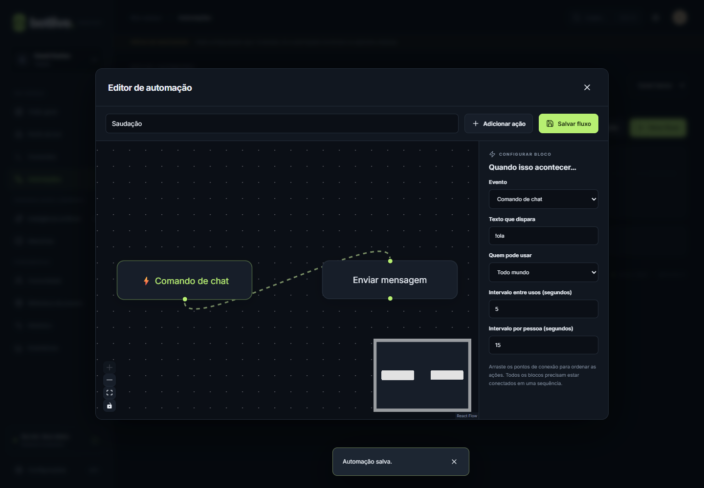

# Comandos e automações

**Escolha rápida:** comando responde a alguém; timer publica pelo tempo; contador guarda quantas vezes um comando foi aceito. Configure timers e contadores diretamente em Comandos. Veja [passos e exemplos completos](TIMERS-E-CONTADORES.md) ou o [catálogo de receitas](EXEMPLOS-DE-USO.md).

Para responder a palavras usando linhas de um arquivo externo, abra **Respostas TXT e sons**. Consulte o [guia de respostas TXT e sons por espectador](RESPOSTAS-E-SONS.md), com configuração, exemplo de arquivo, intervalos e teste sem publicar.

## Inserir informações na mensagem com um clique

Posicione o cursor na resposta e clique em **+ Nome da pessoa**, **+ Nome do canal** ou **+ Texto do pedido**. O aplicativo insere o marcador para você; um texto selecionado é substituído. A leitura abaixo da mensagem mostra etiquetas com os nomes das informações.

Para mais opções, abra **Inserir variável e testar mensagem**. Escolha a informação pelo nome, configure uma alternativa e a forma de apresentação e clique em **Inserir na mensagem**. Códigos técnicos são opcionais no catálogo. Consulte o [guia completo de variáveis](VARIAVEIS.md), incluindo contadores e variáveis por pessoa.

## Escolha o editor adequado

**Comandos** é o caminho rápido para uma resposta textual. **Automações** abre o editor visual e permite combinar ações. São duas visualizações dos mesmos fluxos: um comando criado no modo simples também aparece em Automações.

A imagem mostra a interface de teste. Nomes e conteúdos são exemplos.

## Comando simples

Para responder ao assunto da conversa com humor, use **Resenha com IA**. Escolha um trecho da mensagem e o tom; o aplicativo monta a geração contextual e o envio em sequência. Edite o fluxo depois para mudar os intervalos ou reutilizar a resposta em voz e overlay. A receita completa e o teste sem publicação estão no [capítulo de IA e memória](04-IA-E-MEMORIA.md).

Abra **Comandos → Novo comando**. Preencha nome, comando, resposta, permissão e intervalos. Salve e confira se está ativo.

Um comando como !oi casa com o primeiro termo da mensagem: !oi tudo bem dispara; !oie não dispara. Letras maiúsculas e minúsculas não alteram esse reconhecimento. O nome interno pode conter espaços; o campo Comando não.

| Variável | Conteúdo |
|---|---|
| $user | Nome de quem disparou o evento |
| $message | Mensagem completa recebida, incluindo o comando |
| $channel | Nome do canal cadastrado no perfil |

Exemplo de resposta: Olá, $user! Você está no canal $channel.

A lista permite buscar, editar, ativar/desativar, apagar e salvar um comando como preset. Desativar conserva a configuração. Apagar exige confirmação e não oferece lixeira.

## Permissão e intervalos

| Permissão do gatilho | Quem pode disparar |
|---|---|
| Todo mundo | Qualquer papel reconhecido |
| Assinantes | Assinantes, moderadores e streamer |
| Moderadores | Moderadores e streamer |
| Só o streamer | Papel de proprietário do canal |

Esses papéis vêm do evento. Eles são diferentes das contas locais que editam o aplicativo. Pela API local, todos os eventos externos recebem papel público.

O intervalo global vale para o fluxo, independentemente de quem o usou. O intervalo por pessoa vale para cada participante. Ambos precisam estar liberados. Zero desativa o respectivo intervalo; o limite aceito é 24 horas. A simulação usa intervalos separados das execuções reais.

## Montar uma cadeia visual

1. Abra **Automações → Novo fluxo**.
2. Preencha **Nome do fluxo**.
3. Clique no bloco inicial e escolha Evento, texto, permissão e intervalos.
4. Clique no bloco de ação e selecione **Tipo de ação** no painel lateral.
5. Preencha conteúdo e os campos específicos.
6. Clique em **Adicionar ação** para cada etapa adicional.
7. Arraste dos pontos de conexão para ligar as etapas em ordem.
8. Confira uma única sequência: gatilho → ação 1 → ação 2 → ação 3.
9. Clique em **Salvar fluxo** e confira a chave de ativação.

A posição do bloco no desenho não define a execução; as conexões definem. Blocos novos precisam ser conectados. O editor rejeita ciclos, ramificações e blocos soltos. É possível arrastar os blocos, usar zoom e selecionar uma conexão para removê-la.

Para reorganizar, remova as conexões antigas e conecte a sequência desejada. Não apague o gatilho. São permitidas de 1 a 64 ações.

## Gatilhos disponíveis

| Opção | Uso |
|---|---|
| Timer periódico | Intervalo próprio entre execuções enquanto conectado |
| Comando de chat | Primeiro termo igual ao comando cadastrado |
| Mensagem contém | Trecho presente em uma mensagem de chat |
| Toda mensagem | Qualquer mensagem de chat que chegue ao processamento |
| Novo seguidor | Evento follow |
| Nova inscrição | Evento subscription |
| Bits / Super Chat | Evento cheer |
| Raid | Evento raid |
| Resgate de pontos | Evento redemption |
| Evento externo | Evento custom enviado por integração |
| Comando de voz | Texto reconhecido pelo módulo de voz |

A presença da opção no editor não garante que todas as plataformas emitam aquele evento. Consulte as capacidades do adaptador e confirme com o Histórico.

## Referência das ações

| Ação | O que configurar | Resultado |
|---|---|---|
| Enviar mensagem | Texto e variáveis | Publica no chat do perfil |
| Responder com IA | Instrução, como Responda brevemente: $message | Consulta o provedor configurado e envia a resposta |
| Gerar resposta da IA (variável) | Tom/orientação e nome local da resposta | Usa a conversa recente e guarda o texto para as próximas ações, sem publicar |
| Registrar memória | Conteúdo e arquivo, como eventos/chegadas.md | Acrescenta uma entrada datada na nota |
| Esperar | Milissegundos, até 30000 | Aguarda antes da próxima ação |
| Atualizar overlay | Texto | Emite uma atualização para clientes locais |
| Chamar webhook | Endereço e texto | Envia JSON com text, user e channel |
| Enviar ao Discord | Texto; webhook salvo no módulo Discord | Publica no canal do webhook |
| Ler em voz alta | Texto; módulo TTS ativado | Solicita leitura na interface aberta |
| Ajustar pontos | Número positivo ou negativo; módulo de pontos ativado | Altera o saldo de quem disparou |
| Definir variável | Destino como global.meta e valor 10 | Guarda um valor para uso posterior |
| Incrementar variável | Destino e valor numérico | Soma ao valor atual |
| Apagar variável | Destino | Remove a variável |
| Executar script Rhai | Código que devolve texto | Executa com limites e envia o texto resultante |

Use HTTPS para serviços externos; HTTP é permitido somente no próprio computador. Um webhook pode produzir efeitos reais no destino. Não use a simulação como comprovação de que ele foi recebido.

Scripts Rhai recebem as variáveis user, message e channel, sem o prefixo $. Um exemplo de expressão que retorna texto é: "Olá, " + user + "!". Não são scripts JavaScript nem comandos do Windows.

## Condição opcional

Em uma ação, abra **Condição opcional** e preencha **Executar só se a mensagem contiver**. A ação só roda quando o texto recebido contém esse trecho, sem diferenciar maiúsculas e minúsculas.

Se a condição não casar, apenas aquela ação é pulada; as próximas continuam. Não há bloco de alternativa “senão” nem ramificação visual nesta versão.

## Receita: boas-vindas em três etapas

Crie um comando !cheguei com estas ações:

1. Enviar mensagem: Bem-vindo, $user!
2. Esperar: 1000 milissegundos.
3. Atualizar overlay: $user chegou ao canal!

Salve e simule !cheguei. O histórico comprova a sequência planejada; a espera e o overlay não são executados de verdade na simulação. Para conferir o overlay, conecte o exemplo de OBS e faça um disparo real autorizado.

Você também pode importar examples/boas-vindas.botlivepreset, que contém mensagem e overlay. Revise e ative o fluxo importado.

## Histórico e comportamento em caso de erro

As ações de um fluxo executam em ordem. Se uma falha ou ultrapassa o limite de execução, as ações seguintes daquele fluxo não são executadas. Efeitos anteriores não são desfeitos: uma mensagem já enviada continua publicada.

Outros eventos podem ser processados em paralelo. A ordem é garantida dentro da cadeia, não como exclusividade de toda a transmissão. As saídas de chat são espaçadas por perfil.

Os comandos prontos de Comunidade são processados antes dos fluxos. Evite criar comandos personalizados com os mesmos nomes, como !pontos ou !musica, quando o módulo correspondente estiver ativo.

## Variáveis avançadas

Além dos marcadores tradicionais, o editor oferece catálogo, prévia e as ações Definir variável, Incrementar variável e Apagar variável. Consulte [Variáveis do BotLive](VARIAVEIS.md) para parâmetros de comando, dados do evento, persistência por perfil/pessoa e exemplos completos.
