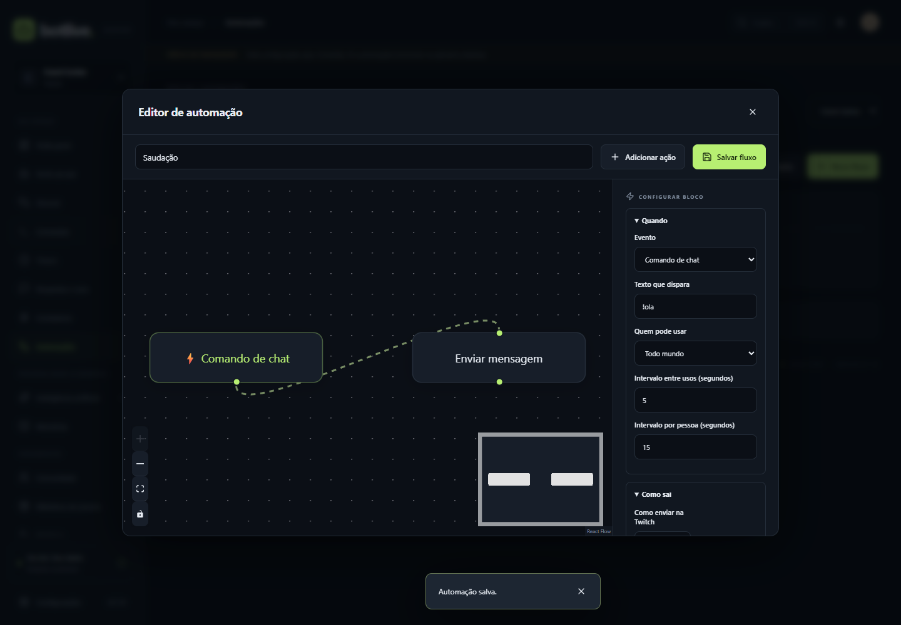

# Comandos e automações

**Escolha rápida:** comando responde a alguém; timer publica pelo tempo; contador guarda quantas vezes um comando foi aceito. Cada um tem sua própria tela: **Comandos**, **Timers** e **Contadores**. Veja [passos e exemplos completos](TIMERS-E-CONTADORES.md) ou o [catálogo de receitas](EXEMPLOS-DE-USO.md).

Para responder a palavras usando linhas de um arquivo externo, abra **Respostas TXT e sons**. Consulte o [guia de respostas TXT e sons por espectador](RESPOSTAS-E-SONS.md), com configuração, exemplo de arquivo, intervalos e teste sem publicar.

## Inserir informações na mensagem com um clique

Posicione o cursor na resposta e clique em **+ Nome da pessoa**, **+ Nome do canal** ou **+ Texto do pedido**. O aplicativo insere o marcador para você; um texto selecionado é substituído. A leitura abaixo da mensagem mostra etiquetas com os nomes das informações.

Para mais opções, abra **Inserir variável e testar mensagem**. Clique na ficha da informação para inserir na hora; em **Opções**, na mesma ficha, configure uma alternativa e a forma de apresentação e clique em **Inserir na mensagem**. Códigos técnicos são opcionais no catálogo. Consulte o [guia completo de variáveis](VARIAVEIS.md), incluindo contadores e variáveis por pessoa.

## Escolha o editor adequado

**Comandos** é o caminho rápido para uma resposta textual. **Automações** abre o editor visual e permite combinar ações. São duas visualizações dos mesmos fluxos: um comando criado no modo simples também aparece em Automações.

No modo simples, **Abrir no editor visual** troca a tela na hora e o botão **?** (**Ajuda do editor de fluxos**) no cabeçalho do editor explica a regra: a ordem das ações vale pelas conexões entre os blocos, não pela posição deles. A mesma ajuda traz, quando o editor veio de um comando ou timer, a nota de que ao salvar ele mantém o mesmo nome, gatilho e ativação. Ao salvar, o comando continua o mesmo, com o mesmo nome, gatilho e ativação, e volta a abrir pelo modo simples enquanto tiver uma só ação. Com mais de uma ação, ele já abre no editor visual.

A imagem mostra a interface de teste. Nomes e conteúdos são exemplos.

## Comando simples

Para responder ao assunto da conversa com humor, use **Resenha com IA**. Escolha um trecho da mensagem e o tom; o aplicativo monta a geração contextual e o envio em sequência. Edite o fluxo depois para mudar os intervalos ou reutilizar a resposta em voz e overlay. A receita completa e o teste sem publicação estão no [capítulo de IA e memória](04-IA-E-MEMORIA.md).

Abra **Comandos** e clique em **Novo comando**. Preencha nome, comando, resposta, permissão e intervalos. Salve e confira se está ativo.

Um comando como !oi casa com o primeiro termo da mensagem: !oi tudo bem dispara; !oie não dispara. Letras maiúsculas e minúsculas não alteram esse reconhecimento.

Quem costuma errar o nome pode cadastrar variações no mesmo campo, separadas por vírgula: `!whislist, !whishlist, !wishlist`. Qualquer uma delas dispara o mesmo comando e cada uma é comparada como palavra inteira, então `!whisli` não dispara. Não deixe espaço dentro de uma mesma variação. O nome interno pode conter espaços; o campo Comando não.

| Variável | Conteúdo |
|---|---|
| {{user}} | Nome de quem disparou o evento |
| {{message}} | Mensagem completa recebida, incluindo o comando |
| {{channel}} | Nome do canal cadastrado no perfil |

Exemplo de resposta: Olá, {{user}}! Você está no canal {{channel}}.

Marcadores antigos escritos com cifrão, como `$user`, são convertidos sozinhos para `{{user}}` quando você salva o comando. O [capítulo de variáveis](VARIAVEIS.md) traz a lista completa.

A lista permite buscar, editar, ativar/desativar, apagar e salvar um comando como preset. Desativar conserva a configuração. Apagar exige confirmação e não oferece lixeira.

## Como enviar na Twitch

Em comandos, timers e automações, **Como enviar na Twitch** escolhe a forma da mensagem publicada. A escolha vale para todas as mensagens enviadas por aquele fluxo.

| Opção | O que aparece no chat |
|---|---|
| Mensagem normal | Mensagem comum do bot, igual a qualquer outra |
| Anúncio | Banner colorido no chat; **Cor do anúncio** aceita a cor do canal, azul, verde, laranja ou roxo |
| Mensagem fixada | Comunicado fixado no topo do chat por cerca de 20 minutos |
| Destaque de canal | A Twitch destaca outro canal; a mensagem é apenas o nome do destino, como `outrocanal` ou `{{user}}` |

As três últimas opções existem só na Twitch. Nas demais plataformas a mensagem sai como mensagem comum e o **Histórico** registra um aviso com essa explicação.

Anúncio, mensagem fixada e destaque exigem bot moderador do canal. Autorizações feitas antes desta versão não têm essas permissões: clique em **Autorizar conta do bot** e **Autorizar conta do canal** novamente e salve o perfil. Quando a Twitch recusa, o aviso aparece no **Histórico** dizendo o que corrigir, e a cadeia de ações pára naquele ponto. Destaque de canal só funciona com o canal ao vivo e respeita os limites da Twitch para destaques.

A prévia registra a forma escolhida no **Histórico**, por exemplo `[Simulação] [Anúncio] O ifood já passou a milhão na rua 3 vezes!`, para conferir sem publicar nada.

**Responder a quem enviou** fica logo abaixo e é um interruptor: com ele ligado, a mensagem sai no fio da pessoa que disparou, como um reply da Twitch, em vez de solta no chat. Vale para comandos, timers e automações que partem de uma mensagem. Na Twitch e no Discord a resposta direcionada existe; nas demais plataformas o **Histórico** registra o aviso e a mensagem sai comum.

O fio vale para a forma escolhida em **Como enviar na Twitch**; se você trocar para anúncio, mensagem fixada ou destaque, a mensagem sai sem o fio e o próprio aviso do campo avisa disso. A prévia mostra a escolha no **Histórico**.

## Tocar áudio ao disparar

**Tocar áudio ao disparar** escolhe um som da biblioteca de **Respostas e sons** para tocar quando o comando, o timer ou a automação executar. O som sai na saída de áudio do BotLive: capture essa saída no OBS para a live ouvir. Use **Escolher som** para importar um arquivo novo, **Testar som** para ouvir antes de salvar e **Volume** para ajustar a intensidade.

O áudio é solicitado antes das ações, na mesma execução da contagem do comando. Com **Contar usos deste comando** ativado, a resposta `O ifood já passou a milhão na rua {{commandCount}} vezes!` sai com o número certo enquanto o som toca. Escrever `{{commandCount}}` na resposta já liga **Contar usos deste comando** sozinho quando você salva: não é preciso lembrar do interruptor.

- **Nenhum áudio** é o padrão: nada é tocado e a execução é igual à de antes.
- A simulação nunca toca som; o **Histórico** mostra `[Simulação] Tocaria o áudio do fluxo`.
- Se o arquivo for apagado de **Respostas e sons**, o fluxo continua sem som e o **Histórico** pede para escolher outro.
- O áudio do fluxo não depende de **Ativar sons por espectador** e não usa os intervalos daqueles sons.

## Permissão e intervalos

| Permissão do gatilho | Quem pode disparar |
|---|---|
| Todo mundo | Qualquer papel reconhecido |
| Assinantes | Assinantes, moderadores e streamer |
| Moderadores | Moderadores e streamer |
| Só o streamer | Papel de proprietário do canal |

Esses papéis vêm do evento. Eles são diferentes das contas locais que editam o aplicativo. Pela API local, todos os eventos externos recebem papel público.

O intervalo global vale para o fluxo, independentemente de quem o usou. O intervalo por pessoa vale para cada participante. Ambos precisam estar liberados. Zero desativa o respectivo intervalo; o limite aceito é 24 horas. A simulação usa intervalos separados das execuções reais.

## Montar uma cadeia visual

1. Abra **Automações → Novo fluxo**.
2. Preencha **Nome do fluxo**.
3. Clique no bloco inicial: o painel lateral se abre em seções. **Quando** reúne Evento, texto que dispara, quem pode usar e intervalos; **Como sai** traz a forma de envio na Twitch e o áudio do disparo; **Comportamento**, recolhido, guarda a contagem de usos e o intervalo do timer.
4. Clique no bloco de ação e selecione **Tipo de etapa** na seção **Configurar etapa** do painel lateral.
5. Preencha conteúdo e os campos específicos. Em ações de IA, abra **Como esta ação responde** para escolher ancoragem, tamanho, base de conhecimento, repetição e tom daquele bloco; o que ficar em **Padrão do perfil** herda a tela de IA. O que é secundário fica na seção **Avançado**, recolhida no início: **Como a IA monta a resposta**, a prévia **Testar resposta contextual** e, no OBS, o botão **Testar no OBS**. Recolher **Avançado** não apaga nada do que você digitou nele, e a seção **Comportamento** continua com a condição opcional.
6. Em uma etapa **Condição**, escolha a variável no seletor com busca: digite o nome (`custo` encontra "Custo da recompensa"), a categoria (`Eventos`) ou o identificador técnico (`reward.cost`) e clique no resultado. O seletor abre abaixo do painel sem ser cortado, aceita teclado (setas e Enter) e fecha com Escape sem fechar o editor. Um valor salvo por versões antigas que não está mais no catálogo aparece no topo do seletor, preservado.
7. Clique em **Adicionar etapa** para cada etapa adicional: a nova etapa nasce já ligada à última (ou ao gatilho, quando ainda não há etapa nenhuma), vem selecionada com a configuração aberta e aparece em espaço livre no canvas.
8. Para enfiar uma etapa no meio da sequência, use **••• → Inserir etapa depois** na etapa que vem antes; arraste dos pontos de conexão quando quiser religar um trecho à mão.
9. Confira uma única sequência: gatilho → ação 1 → ação 2 → ação 3.
10. Clique em **Salvar fluxo** e confira a chave de ativação.

Cada bloco já mostra na tela um resumo legível da etapa — por exemplo ◆ CONDIÇÃO com variável, operador e valor, ◉ OBS · Mostrar fonte · alvo ou ◷ 3,0 s de espera — e a cadeia se empilha de cima para baixo, dá para ler o fluxo só pelo desenho sem abrir bloco nenhum; fluxos salvos antes disso ganham os mesmos rótulos quando você os abre. **Adicionar etapa** acrescenta a etapa no fim da cadeia já ligada à última, seleciona o bloco novo e abre a configuração dele sem redefinir o zoom, em espaço livre sem cobrir os vizinhos. **Inserir etapa depois**, no menu **•••**, troca apenas a conexão daquele trecho: de A → B você passa para A → nova → B, com os dados de A e de B intactos e a etapa nova já selecionada; só o espaço necessário é aberto, no mesmo eixo do desenho, e uma fila antiga na horizontal continua na horizontal, sem reorganizar o resto do canvas. Quando o fluxo está desconectado, em ciclo ou com mais de uma saída na mesma etapa, nada é criado nem reorganizado: o editor explica o problema em português no topo e os blocos permanecem como estavam. A posição do bloco no desenho não define a execução; as conexões definem. O fim do painel lateral repete essa regra sempre que um bloco está selecionado. O editor rejeita ciclos, ramificações e blocos soltos, e continua aceitando conexões feitas à mão: é possível arrastar os blocos, usar zoom e selecionar uma conexão para removê-la.

Quando o salvamento é recusado, o motivo aparece em português no topo do editor. Se o texto original for técnico, ele continua disponível em **Detalhes técnicos**, dentro do próprio aviso de erro. Além disso, campos obrigatórios vazios são apontados antes do envio: ao tentar salvar, a orientação aparece ao lado do campo — **Escolha uma variável** na Condição; **Escolha uma cena**, **Escolha uma entrada de áudio** ou **Escolha uma fonte** no OBS, conforme a operação — e a etapa que precisa de correção fica destacada em vermelho no canvas, com o painel lateral já selecionando-a. O restante continua validado pelo backend.

Para reorganizar, selecione a etapa e use o menu **••• (Opções da etapa)** no painel lateral: **Subir** e **Descer** trocam a etapa com a vizinha refazendo as conexões — a primeira não sobe, a última não desce e o gatilho não tem esse menu. **Inserir etapa depois** entra no mesmo menu sempre que o fluxo é uma única cadeia válida; com bloco solto, ciclo ou ramificação a opção não aparece e nada muda no desenho. O menu fecha ao escolher uma opção, clicar fora ou apertar Escape, que devolve o foco ao botão; abrir e fechar o menu não altera o fluxo. A ordem de execução continua sendo a das conexões. Ainda dá para remover as conexões antigas e religar a sequência à mão. Não apague o gatilho. São permitidas de 1 a 64 ações.

Uma etapa **Condição** com **Se falso → Pular a próxima etapa** pula exatamente a etapa que vem depois dela na ordem das conexões — não um bloco fixo. Se você inserir uma etapa logo depois da condição, a nova passa a ser a próxima: quando a condição falha, é ela que fica de fora e a seguinte executa. **Parar o fluxo** não muda com a inserção: a condição falsa encerra a execução na hora.

Na barra do editor, o botão **Minimapa** mostra ou esconde o minimapa do canvas. Ele começa recolhido para deixar mais espaço para o fluxo; quando abre, aparece compacto no canto inferior direito, sem cobrir os controles de zoom, e a preferência fica guardada localmente neste navegador, fora do layout do fluxo (reabrir o editor mantém a escolha). Mostrar ou esconder não mexe em zoom, arraste, seleção, conexões nem no ajuste da tela. O botão **?** ao lado do nome do fluxo abre a **Ajuda do editor de fluxos**, com a explicação de que a ordem das etapas segue as conexões entre os blocos — a mesma que antes aparecia em destaque — e, quando o editor veio de um comando ou timer, a nota de que nome, gatilho e ativação são conservados. A ajuda abre por clique ou pelo teclado (foco no botão e Enter), cabe em tela pequena e fecha com Escape sem fechar o editor; avisos de erro continuam aparecendo no topo do editor, fora da ajuda.

## Gatilhos disponíveis

| Opção | Uso |
|---|---|
| Timer periódico | Intervalo próprio entre execuções enquanto conectado |
| Comando de chat | Primeiro termo igual a uma das variações cadastradas; separe as variações com vírgula |
| Mensagem contém | Trecho presente em uma mensagem de chat; separe várias palavras ou frases com vírgula e basta uma delas aparecer |
| Chamada pelo nome do bot | O bot é chamado pelo nome na mensagem; separe os nomes com vírgula e o gatilho passa quando um deles aparece como palavra inteira |
| Toda mensagem | Qualquer mensagem de chat que chegue ao processamento |
| Novo seguidor | Evento follow |
| Nova inscrição | Evento subscription, com `{{subscription.tier}}` |
| Nova re-inscrição | Evento resub, com meses, sequência e mensagem |
| Sub de presente | Evento gift, com quem presenteou (`{{gifter.name}}`) e quantidade |
| Bits / Super Chat | Evento cheer, com `{{bits.amount}}` |
| Raid | Evento raid, com `{{raider.name}}` e `{{raid.viewers}}` |
| Resgate de pontos | Evento redemption, com filtro por recompensa e confirmação automática |
| Evento externo | Evento custom enviado por integração |
| Comando de voz | Trecho da fala transcrita; separe variações com vírgula e basta uma delas aparecer |

A presença da opção no editor não garante que todas as plataformas emitam aquele evento. Consulte as capacidades do adaptador e confirme com o Histórico.

**Chamada pelo nome do bot** existe para o caso em que o espectador escreve o nome do bot sem marcar com `@`, como "Arroba, vem aqui". A lista é de nomes separados por vírgula, e a comparação é por palavra inteira: com `Arroba, ArrobaSrv`, a mensagem "ArrobaSrv mandou" não dispara o gatilho pelo nome curto, porque `ArrobaSrv` é uma palavra só, não `Arroba`. O gatilho considera só mensagens de chat e respeita os mesmos intervalos por fluxo e por pessoa dos demais gatilhos.

**Comando de chat** também aceita variações separadas por vírgula, como `!whislist, !whishlist, !wishlist`. Cada variação começa com `!`, não contém espaço e é comparada como palavra inteira. Use esse recurso para o erro de digitação mais comum do seu público: quem escreveu errado dispara o mesmo comando e recebe a mesma resposta. A prévia usa a primeira variação da lista.

**Resgate de pontos** dispara no resgate de recompensa da Twitch. No editor visual, escolha a recompensa pela lista (a identidade é o ID: renomear na Twitch não quebra); vazio vale qualquer resgate. Variáveis do resgate: `{{redeemer}}`, `{{rewardTitle}}`, `{{rewardCost}}`, `{{rewardId}}` e `{{userInput}}`. Quando ao menos uma automação termina tudo, o BotLive marca o resgate como cumprido; sem a permissão nova, o Histórico pede para reautorizar a conta do canal (gerenciar resgates). A simulação nunca confirma resgate de verdade.

**Regra de responsabilidade:** filtros de valor moram na etapa Condição, não no gatilho. Ex.: gatilho Bits + condição `bits.amount >= 500`. A única exceção estrutural é o resgate, que precisa do ID da recompensa para achar a automação certa.

**Comandos nativos da Twitch no chat**: `!setgame Nome do Jogo` e `!settitle Novo título` funcionam digitados no chat por moderadores e streamer, sem precisar de automação (categoria, título e VIP com a conta do canal; o resto com a conta do bot). O bot confirma no chat marcando quem pediu, com o nome oficial do jogo. Para falar em vez de digitar, use o gatilho Comando de voz com a ação Ação na Twitch: os dois caminhos fazem o mesmo. Se você criar uma automação própria com o mesmo comando, a sua vale em vez da nativa, inclusive a mensagem de confirmação. Para mensagem própria que varia com o jogo em uma automação só: comando `!setgame` com permissão de moderadores, ação 1 de categoria com conteúdo vazio e ação 2 de mensagem como `@{{user}} agora é {{local.twitchGame}}!`. A ação da Twitch guarda `local.twitchGame`, `local.twitchGameId`, `local.twitchTitle` e `local.twitchTarget` para as ações seguintes do mesmo fluxo.

**Comando de voz** também aceita variações separadas por vírgula, como `troca o jogo, muda o jogo, minecraft`. Basta uma delas aparecer na fala transcrita, sem diferenciar maiúsculas de minúsculas. Use esse recurso para os jeitos diferentes de pedir a mesma coisa: quem falou de outro jeito dispara a mesma automação.

## Referência das ações

| Ação | O que configurar | Resultado |
|---|---|---|
| Enviar mensagem | Texto e variáveis | Publica no chat do perfil |
| Responder com IA | Instrução, como Responda brevemente: {{message}}, e **Como esta ação responde** | Consulta o provedor configurado e envia a resposta |
| Gerar resposta da IA (variável) | Tom/orientação, nome local da resposta e **Como esta ação responde** | Usa a conversa recente, o que a live está fazendo agora e a base de conhecimento, e guarda o texto para as próximas ações, sem publicar |
| Registrar memória | Conteúdo e arquivo, como eventos/chegadas.md | Acrescenta uma entrada datada na nota |
| Esperar | Milissegundos, até 30000 | Aguarda antes da próxima ação |
| Atualizar overlay | Texto | Emite uma atualização para clientes locais |
| Chamar webhook | Endereço e texto | Envia JSON com text, user e channel |
| Enviar ao Discord | Texto; webhook salvo no módulo Discord | Publica no canal do webhook |
| Ler em voz alta | Texto; módulo TTS ativado | Solicita leitura na interface aberta |
| Ajustar pontos | Número positivo ou negativo; módulo de pontos ativado | Altera o saldo de quem disparou |
| Definir variável | Destino como global.meta e valor 10 | Guarda um valor para uso posterior |
| Incrementar variável | Destino e valor numérico | Soma ao valor atual |
| Apagar variável | Destino | Remove a variável |
| Punir na Twitch | O que aplicar (silenciar por um tempo, banir ou avisar), duração quando for silêncio, quem leva a punição (quem enviou, primeiro argumento ou sorteado no chat) e motivo | Aplica a punição na conta indicada; só em perfil Twitch e só com a conta do canal autorizada |
| Aguardar | Duração com unidade (milissegundos, segundos ou minutos), até 1 hora | Pausa a sequência sem travar o resto; cancelável pelo teste |
| Executar script Rhai | Código que devolve texto | Executa com limites e envia o texto resultante |
Na ação **Ação na Twitch (conta do bot)**, escolha a operação:

Use HTTPS para serviços externos; HTTP é permitido somente no próprio computador. Um webhook pode produzir efeitos reais no destino. Não use a simulação como comprovação de que ele foi recebido.

Scripts Rhai recebem as variáveis user, message e channel, sem o prefixo $. Um exemplo de expressão que retorna texto é: "Olá, " + user + "!". Não são scripts JavaScript nem comandos do Windows.

Na ação **Punir na Twitch**, **Quem leva a punição** escolhe entre quem enviou a mensagem, o primeiro argumento do comando e um sorteado no chat. No segundo caso, escreva o alvo depois do comando, como `!silenciar @alvo`; o nome é convertido em ID da Twitch antes da ação. No sorteio, o bot escolhe entre quem já falou no chat (nunca o streamer) e guarda o nome em `{{local.punished}}` para a mensagem seguinte, como `{{local.punished}} rodou feio e levou timeout!`. O motivo fica registrado na Twitch e no Histórico. Restrinja o gatilho em **Quem pode usar** para Moderadores ou Só o streamer, senão qualquer pessoa do chat pode punir. A duração vai de 1 segundo a 14 dias e vale só para o modo silenciar. A prévia e a simulação não pune ninguém: mostram apenas o plano no Histórico. Perfis fora da Twitch recusam a ação com aviso.

## Sequências: etapas, espera e teste

Todo fluxo já é uma sequência: as ações executam em ordem e cada etapa tem interruptor próprio (**Etapa ativa**; desligada pula com `pulada` no Histórico, sem erro), o menu **••• (Opções da etapa)** com **Subir/Descer** e **Inserir etapa depois** e a ação **Aguardar** (duração + unidade, até 1 hora). Uma falha para as etapas seguintes, como sempre.

Cada execução ganha identidade (`Execução abc12345`) nas linhas de início e fim do Histórico. **Testar fluxo** executa de verdade OBS, espera, overlay e variáveis locais, pulando envios e efeitos externos (chat, IA, Discord, som da conta, punição, Twitch) com aviso; o progresso mostra ✓/⏳ por etapa e o **Cancelar** para só aquela execução. Dicas: waits longos pedem cancelamento à mão; temporário do OBS e WAIT são independentes (um restaura estado, o outro só pausa); fluxos antigos continuam ligados e válidos.

Na ação **Ação na Twitch (conta do bot)**, escolha a operação: trocar categoria, trocar título, silenciar, banir, desbanir, avisar, dar ou tirar VIP, ligar ou desligar modo lento, só seguidores, só assinantes, só emotes, destaque de canal, responder marcando arroba ou criar clipe da live. O alvo sai da fala nesta ordem: arroba menção primeiro, depois nome de quem está no chat, depois o alvo fixo da automação. Sem nenhum, o bot avisa no Histórico e não executa (o clipe não precisa de alvo: vale com a live ligada). A duração do silêncio e os intervalos usam o primeiro número da fala, ou o valor do editor quando a fala não traz número. Fale os dígitos, como 300. Para categoria e título, deixe o conteúdo vazio para usar o que você falou: o bot remove a palavra de ativação, o gatilho que casou e as palavras de ligação, como em Arroba troca o jogo para Valorant. Se a Twitch não reconhecer o nome, ele tenta com iniciais maiúsculas; nomes fixos no conteúdo são mais certeiros. O bot precisa ser moderador do canal para moderação e modos do chat, com a conta do bot reautorizada; categoria, título e VIP executam com a conta do canal, reautorize a conta do canal após atualizar, pois os escopos novos exigem nova autorização. O clipe exige a conta do bot reautorizada (permissão nova de clipes) e só funciona com a live ligada: o link sai em `{{local.clipUrl}}` para a mensagem seguinte. A prévia e a simulação não executam: mostram apenas o plano no Histórico.

## Condição opcional

Em uma ação, abra a seção **Comportamento** do painel lateral e preencha **Executar só se a mensagem contiver**. A ação só roda quando o texto recebido contém esse trecho, sem diferenciar maiúsculas e minúsculas.

Se a condição não casar, apenas aquela ação é pulada; as próximas continuam. Não há bloco de alternativa “senão” nem ramificação visual nesta versão.

## Receita: boas-vindas em três etapas

Crie um comando !cheguei com estas ações:

1. Enviar mensagem: Bem-vindo, {{user}}!
2. Esperar: 1000 milissegundos.
3. Atualizar overlay: {{user}} chegou ao canal!

Salve e simule !cheguei. O histórico comprova a sequência planejada; a espera e o overlay não são executados de verdade na simulação. Para conferir o overlay, conecte o exemplo de OBS e faça um disparo real autorizado.

Você também pode importar examples/boas-vindas.botlivepreset, que contém mensagem e overlay. Revise e ative o fluxo importado.

## Histórico e comportamento em caso de erro

As ações de um fluxo executam em ordem. Se uma falha ou ultrapassa o limite de execução, as ações seguintes daquele fluxo não são executadas. Efeitos anteriores não são desfeitos: uma mensagem já enviada continua publicada.

Quando várias automações casam na mesma mensagem, apenas uma publica a resposta. A ordem de decisão é o tipo do gatilho — comando, depois chamada pelo nome, depois contém, depois toda mensagem — e, entre gatilhos do mesmo tipo, vence o mais específico: primeiro o de menos variações e mais letras, depois o que aparece antes na lista de Automações. Os demais fluxos continuam rodando normalmente: contagem, pontos, memórias, áudio, webhook e as demais ações paralelas seguem; só a publicação de resposta fica de fora. O Histórico registra **Outra automação já respondeu esta mensagem; os demais efeitos continuam** para mostrar o que foi retido.

Outros eventos podem ser processados em paralelo. A ordem é garantida dentro da cadeia, não como exclusividade de toda a transmissão. As saídas de chat são espaçadas por perfil.

Os comandos prontos de Comunidade são processados antes dos fluxos. Evite criar comandos personalizados com os mesmos nomes, como !pontos ou !musica, quando o módulo correspondente estiver ativo.

## Variáveis avançadas

Além dos marcadores tradicionais, o editor oferece catálogo, prévia e as ações Definir variável, Incrementar variável e Apagar variável. Consulte [Variáveis do BotLive](VARIAVEIS.md) para parâmetros de comando, dados do evento, persistência por perfil/pessoa e exemplos completos.
